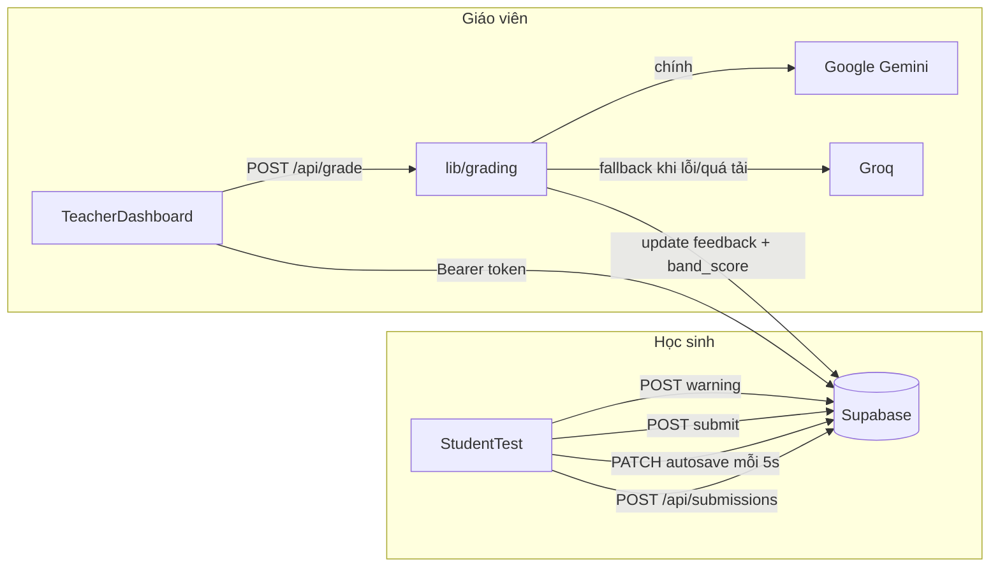

# IELTS Writing Platform

Nền tảng luyện thi & chấm bài **IELTS Writing** (Task 1 + Task 2) — học sinh làm bài trực tuyến có giám sát chống gian lận, giáo viên tạo đề và chấm bài bằng AI (Gemini / Groq) kèm nhận xét chi tiết bằng tiếng Việt.

**Stack:** Next.js 16 (App Router) · React 19 · TypeScript · Tailwind CSS 4 · Supabase (Postgres + Auth + Storage) · Groq / Google Gemini (chấm bài AI) · Vercel (deploy)

---

## Mục lục

- [Tính năng chính](#tính-năng-chính)
- [Cấu trúc thư mục](#cấu-trúc-thư-mục)
- [Kiến trúc & luồng dữ liệu](#kiến-trúc--luồng-dữ-liệu)
- [Bắt đầu nhanh](#bắt-đầu-nhanh)
- [Biến môi trường](#biến-môi-trường)
- [Schema cơ sở dữ liệu](#schema-cơ-sở-dữ-liệu)

---

## Tính năng chính

- **Học sinh:** vào link đề thi → nhập tên → làm bài toàn màn hình (fullscreen) có đồng hồ đếm ngược, tự động lưu bài mỗi 5 giây, tự nộp khi hết giờ.
- **Chống gian lận:** phát hiện thoát fullscreen / chuyển tab / mất focus cửa sổ, cảnh báo tối đa 5 lần trước khi tự động hủy bài.
- **Giáo viên:** tạo/sửa đề thi (kèm ảnh biểu đồ cho Task 1), theo dõi bài làm, chấm bằng AI (Gemini → fallback Groq) theo band descriptor IELTS chính thức, tự tính lại band tổng từ 4 tiêu chí (TA/TR, CC, LR, GRA) thay vì tin số model tự viết, thêm nhận xét thủ công, chọn nhiều để xóa/tải hàng loạt, xuất từng bài hoặc cả loạt ra file `.doc`/`.zip`.
- Giao diện giáo viên có layout **master-detail thích ứng mobile** (danh sách và chi tiết bài làm chuyển màn hình riêng trên điện thoại, hiện song song trên desktop).

## Cấu trúc thư mục

```
src/
├── app/                              # Next.js App Router — routing & API
│   ├── login/page.tsx                # Đăng nhập giáo viên
│   ├── teacher/page.tsx              # Trang giáo viên (chỉ render <TeacherDashboard/>)
│   ├── test/[id]/page.tsx            # Trang học sinh làm bài (chỉ render <StudentTest/>)
│   └── api/
│       ├── grade/route.ts                        # POST — chấm bài AI + tự tính lại band (yêu cầu đăng nhập)
│       └── submissions/
│           ├── route.ts                          # POST — học sinh bắt đầu bài thi (public)
│           ├── bulk-delete/route.ts              # POST — xóa hàng loạt bài nộp (yêu cầu đăng nhập)
│           └── [id]/
│               ├── route.ts                      # PATCH — autosave nội dung / lưu nhận xét (public + protected tùy field)
│               ├── submit/route.ts               # POST — nộp bài chính thức (public)
│               └── warning/route.ts              # POST — ghi nhận vi phạm chống gian lận (public)
│
├── components/
│   ├── auth/
│   │   ├── LoginForm.tsx
│   │   └── AuthStatus.tsx
│   │
│   ├── teacher/                      # Toàn bộ UI trang giáo viên
│   │   ├── TeacherDashboard.tsx           # Orchestrator: layout, tab, ghép các hook + component con
│   │   ├── SubmissionList.tsx             # Danh sách bài nộp + chọn nhiều/xóa hàng loạt/tải tất cả
│   │   ├── SubmissionDetail.tsx           # Chi tiết 1 bài làm: nội dung, hành động chấm/xuất/xóa, nhận xét
│   │   ├── GradingResultPanel.tsx         # Khối hiển thị kết quả chấm AI (band, tiêu chí, lỗi sửa)
│   │   ├── ExaminerSummaryCard.tsx        # Thẻ nhận xét giám khảo, tách theo từng phần bài viết
│   │   ├── band-sanitizer.ts              # Lọc câu văn xuôi nhắc sai số band không khớp điểm đã chấm
│   │   ├── submission-utils.tsx           # Style/label trạng thái + helper dùng chung 3 file trên
│   │   ├── ExamCreateForm.tsx             # Tab "Quản lý đề thi" (dùng hook useTests)
│   │   ├── GradingProgressModal.tsx       # Modal "đang chấm điểm"
│   │   └── FeedbackExport.tsx
│   │
│   └── test/                         # Toàn bộ UI trang học sinh làm bài
│       ├── StudentTest.tsx               # Orchestrator: state + gọi API start/autosave/submit
│       ├── SetupScreen.tsx               # Màn hình nhập tên trước khi thi
│       ├── TaskCard.tsx                  # Thẻ đề bài + khung viết (dùng chung Task 1 & 2)
│       ├── NavPill.tsx                   # Nút điều hướng nhanh trong sub-nav
│       ├── ImageZoomOverlay.tsx          # Modal phóng to ảnh biểu đồ Task 1
│       ├── DisqualifiedScreen.tsx        # Màn hình bị hủy bài thi
│       └── SubmittedScreen.tsx           # Màn hình nộp bài thành công
│
├── hooks/
│   ├── teacher/                      # Logic nghiệp vụ của dashboard giáo viên, tách khỏi UI
│   │   ├── useTeacherAuth.ts             # Check đăng nhập (client) + tự động đăng xuất sau 30 phút rảnh
│   │   ├── useSubmissions.ts             # Load bài nộp, chấm điểm, xóa 1 bài, lưu nhận xét
│   │   ├── useBulkActions.ts             # Chọn nhiều, xóa hàng loạt, tải tất cả (.zip)
│   │   └── useTests.ts                   # CRUD đề thi + upload ảnh Task 1
│   ├── useAntiCheat.ts                # Phát hiện & báo cáo hành vi gian lận (học sinh)
│   └── useExamTimer.ts                # Đếm ngược dựa trên mốc thời gian từ server (học sinh)
│
└── lib/
    ├── types.ts                       # Kiểu dữ liệu dùng chung (SubmissionRow, TestRow, Correction, GradingFeedback...)
    ├── supabase.ts                     # Supabase client phía browser (anon key) + getAuthHeader() cho fetch
    ├── supabase-admin.ts               # Supabase client phía server (service role, bypass RLS)
    ├── auth-server.ts                  # requireAuth()/getAuthenticatedUser() — xác thực Bearer token ở API route
    ├── student-test-utils.ts           # Hằng số & hàm thuần dùng riêng cho trang làm bài
    ├── grading/                        # Pipeline chấm điểm AI
    │   ├── index.ts                       # Điểm vào công khai (giữ nguyên đường dẫn import @/lib/grading)
    │   ├── prompt.ts                      # TASK_CONFIG + system prompt giám khảo IELTS
    │   ├── provider.ts                    # Gọi Gemini (chính) → fallback Groq khi lỗi/quá tải
    │   ├── parse.ts                       # Parse & làm sạch JSON model trả về + parseSubmissionContent
    │   └── schema.ts                      # Schema/kiểu dữ liệu response kỳ vọng từ model
    └── teacher/
        └── exportDoc.ts                # Build & tải file .doc / .zip cho 1 hoặc nhiều bài làm
```

**Nguyên tắc tổ chức:** mỗi trang lớn (`TeacherDashboard`, `StudentTest`) là một **orchestrator mỏng** — chỉ ghép state/hook cấp cao, còn UI chia theo màn hình/khu vực chức năng thành component con trong cùng thư mục con của `components/`, và logic nghiệp vụ (fetch, state phức tạp) tách riêng vào `hooks/teacher/`. Logic không phụ thuộc React (build prompt, parse JSON, build file export) nằm trong `lib/`, có thể unit-test độc lập.

## Kiến trúc & luồng dữ liệu



- **Ghi dữ liệu học sinh** (`/api/submissions`, `/submit`, `/warning`, autosave nội dung qua PATCH) dùng **service-role key** (bypass RLS) và **cố ý public** — học sinh làm bài không cần tài khoản.
- **Đọc dữ liệu giáo viên** qua Supabase client (anon key) được bảo vệ bằng **Row Level Security**: chỉ user đã đăng nhập mới đọc được `submissions`/`tests`.
- **Các thao tác chỉ-giáo-viên** (`/api/grade`, `/api/submissions/bulk-delete`) dùng service-role key nhưng bắt buộc có JWT hợp lệ: client gắn `Authorization: Bearer <access_token>` (qua `getAuthHeader()`), server xác minh bằng `requireAuth()` (gọi `auth.getUser(token)` để Supabase Auth server tự xác thực chữ ký/hạn dùng, không tự giải mã token rồi tin payload).
- **`useTeacherAuth`** chỉ là gác ở client (ẩn/hiện UI + tự đăng xuất sau 30 phút rảnh) — lớp bảo vệ thật sự nằm ở RLS (đọc) và `requireAuth()` (ghi/thao tác tốn phí), không phải ở route `/teacher` tự nó.

## Bắt đầu nhanh

```bash
npm install
cp .env.local.example .env.local   # điền các biến bên dưới
npm run dev
```

Mở [http://localhost:3000](http://localhost:3000). Deploy production dùng Vercel (`vercel.json`).

## Biến môi trường

| Biến | Bắt buộc | Mô tả |
|---|---|---|
| `NEXT_PUBLIC_SUPABASE_URL` | ✅ | URL project Supabase |
| `NEXT_PUBLIC_SUPABASE_ANON_KEY` | ✅ | Anon key (client, bị giới hạn bởi RLS) |
| `SUPABASE_SERVICE_ROLE_KEY` | ✅ | Service role key (chỉ dùng ở server, bypass RLS) |
| `GOOGLE_GEMINI_API_KEY` | ✅ | Provider chấm bài chính |
| `GEMINI_MODEL` | ⛔ (mặc định `gemini-3.5-flash`) | Override model Gemini |
| `GROQ_API_KEY` | ✅ | Provider chấm bài dự phòng khi Gemini lỗi/quá tải |
| `GROQ_MODEL` | ⛔ (mặc định `llama-3.3-70b-versatile`) | Override model Groq |

## Schema cơ sở dữ liệu

Xem chi tiết đầy đủ (cột, ràng buộc, RLS policy) trong [`schema.sql`](./schema.sql). Tóm tắt 4 bảng chính:

| Bảng | Vai trò |
|---|---|
| `profiles` | Tài khoản giáo viên (mọi user đăng ký = giáo viên, không phân quyền thêm) |
| `tests` | Đề thi: tiêu đề, đề Task 1/2, ảnh biểu đồ, thời lượng |
| `submissions` | Bài làm học sinh: nội dung, trạng thái, điểm & nhận xét AI (`feedback`, `band_score`), nhận xét giáo viên |
| `warnings` | Lịch sử các lần vi phạm chống gian lận theo từng `submission` |